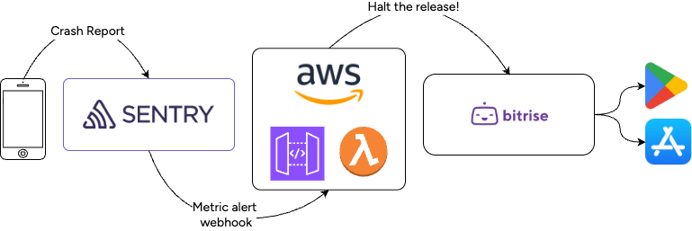

# Overview

Back in the old days, I would publish a new version of my app to the App Store or Play Store using the phased rollout. Over the next few days, I would have to periodically check the crash rate and other SLOs. If there was a show-stopper problem that couldn't be addressed with remote config, I would halt the release and get to work on a hotfix. 

This gist explains how you can automate the halting of the rollout. Automating this means faster responset time and less toil.

## Components

* Sentry SDK: tracks crashes and other stability events in the app and publishes them to the Sentry server
* Sentry server: aggregates crash reports and stability data. Emits webhooks based on custom defined [metric alerts](https://docs.sentry.io/organization/integrations/integration-platform/webhooks/metric-alerts/).
* AWS Lambda: receives the Sentry webhook and calls to Bitrise to halt the release
* Bitrise: [Release Management](https://bitrise.io/platform/devops/release-management) is used to manage mobile app releases.

## How it works

Client-level crash and reliability data flow into Sentry. An [Internal Integration](https://docs.sentry.io/organization/integrations/integration-platform/internal-integration/) is created as a webhook destination. If the [metric alert](https://docs.sentry.io/organization/integrations/integration-platform/webhooks/metric-alerts/) threshold is met, Sentry sends a webhook to AWS, triggering a [Lambda](https://aws.amazon.com/lambda/). The logic within the Lambda decides to halt the release via [Release Management's REST API](https://api.bitrise.io/release-management/api-docs/index.html). 

## How to set it up

1. Set up the [AWS components](aws_components.md).
1. Set up the [Sentry webhook](sentry_webhook).
1. Populate the [code in your Lambda](lambda_code.js).
    - Update the sample code with project specific variables like Bitrise Connected App ID, AWS region, and secret variable names
    - Modify sample code logic for Sentry event parsing and Bitrise Release selection to match project requirements
    - The sample code halts App Store releases. Use the [Play Store pause endpoint](https://api.bitrise.io/release-management/api-docs/index.html#/Releases%20-%20Google%20Play%20Store%20Release/PauseStagedRolloutScheduleAndroid) for Android apps.
