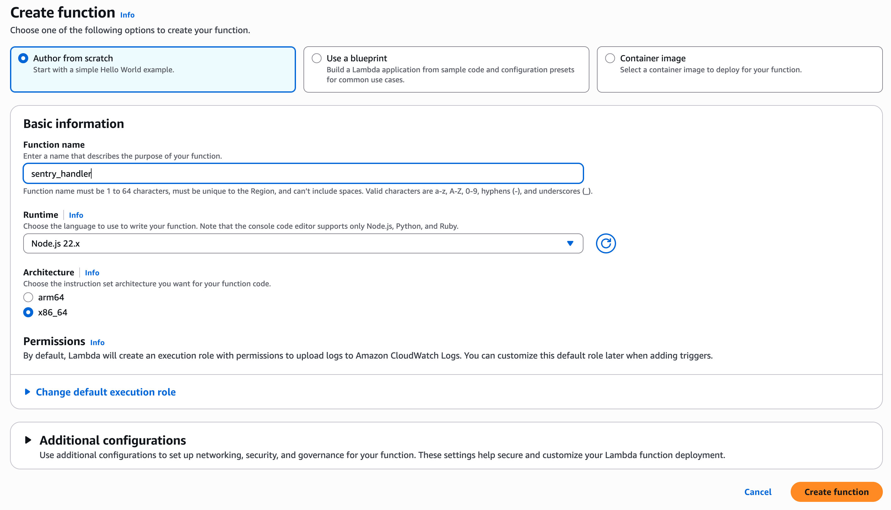
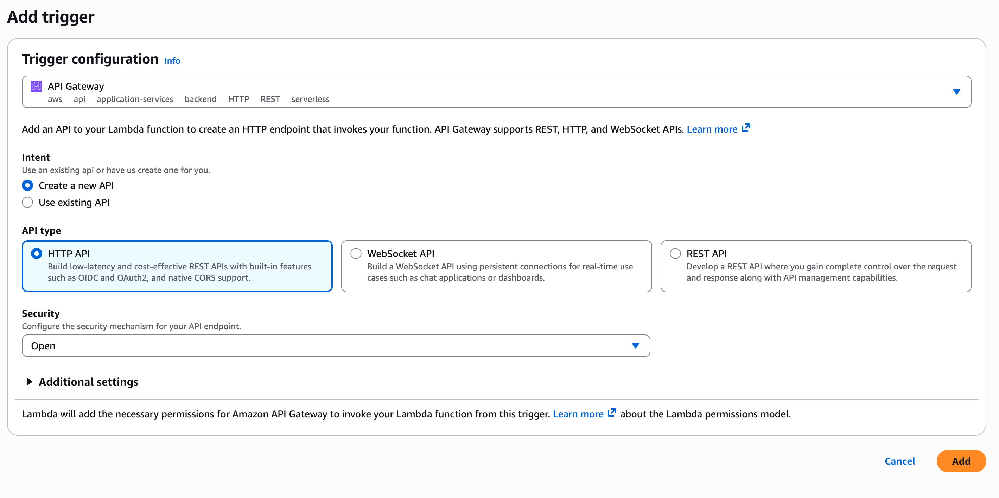
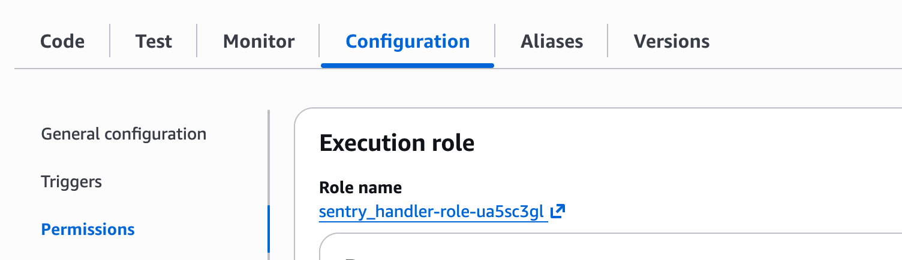
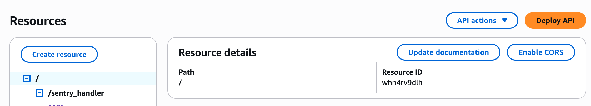

# AWS Components

## Lambda Function

1. Create a Lambda function. Use the default settings provided by the console.



2. Add a trigger. Select API Gateway > Create a new API > REST API with Security Open.




3. On your API Gateway, define a Resource policy (left option menu) that blocks all IP addresses except those [belonging to Sentry](https://docs.sentry.io/security-legal-pii/security/ip-ranges/). This will prevent untrusted sources from making requests to your API.

```
{
  "Version": "2012-10-17",
  "Statement": [
    {
      "Effect": "Allow",
      "Principal": "*",
      "Action": "execute-api:Invoke",
      "Resource": "arn:aws:execute-api:<aws_region>:<your_aws_account_id>:<your_api_id>/*",
      "Condition": {
        "IpAddress": {
          "aws:SourceIp": [ # from docs.sentry.io
            "35.184.238.160/27",
            "104.155.159.128/27",
            "104.155.149.192/27",
            "130.211.230.102/32",
            "34.141.31.19/32",
            "34.141.4.162/32",
            "35.234.78.236/32",
          ]
        }
      }
    }
  ]
}
```

4. On your Lambda, under Configuration > Permissions, under "Resource-based policy statements," ensure your API Gateway has "InvokeFunction" for your Lambda.


5. Create secrets. 

After creating a [Bitrise API token](https://docs.bitrise.io/en/bitrise-platform/accounts/personal-access-tokens.html) [add this to AWS Secrets Manager](https://docs.aws.amazon.com/secretsmanager/latest/userguide/create_secret.html).

In subsequent steps, you will also create a Sentry Client Secret.

Both secrets will need resource policies that make them available to the Lambda function. The policy will look like this:

```
{
  "Version" : "2012-10-17",
  "Statement" : [ {
    "Sid" : "AllowSpecificLambdaReadSecret",
    "Effect" : "Allow",
    "Principal" : {
      "AWS" : "<arn for your Lambda execution role>"
    },
    "Action" : "secretsmanager:GetSecretValue",
    "Resource" : "*"
  } ]
}
```

The ARN for the Lambda execution role comes from your Lambda's Configuration > Permissions section. You can click the link on this section to open a page with a click-to-copy version of the ARN.



6. Deploy the API Gateway and Lambda

Use the "Deploy" button under the Code section of the Lambda to deploy the Lambda (we will add the code shortly). Use the "Deploy API" button in the Resources section of the API Gateway to deploy the API.




Deploying the API will require creating a stage, and the stage will contain the Invoke URL. That URL will be used when setting up the Sentry internal integration.