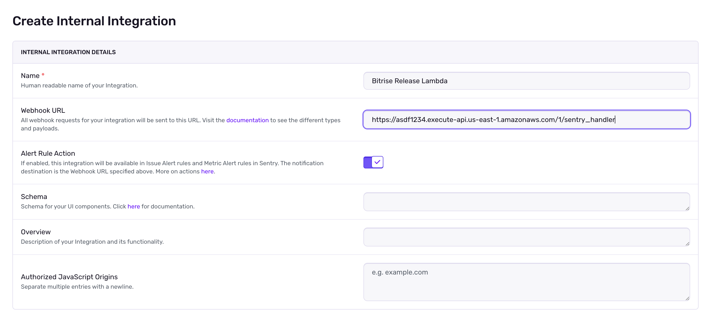

# Setting up the Sentry Webhook

## Create the Internal Integration

In your project's settings menu, click the "Integrations" item. Click "Create New Integration" and select "Internal Integration"

After naming your integration (ex. Bitrise Release Lambda), use the URL from your API Gateway stage for the Webhook URL. Append the file path for your lambda resource to the URL. Enable Alert Rule Action. Click Save Changes.

## Add a metric alert
Go to your project alerts page, click "Create Alert," select the type of alert you want (ex. Crash Free User Rate), and click "Set Conditions." Define the events and thresholds you prefer and then add an Action. Change the action from email to your recently created integration.

You now have a metric alert that will send a webhook to the AWS Lambda when the SLO is breached.